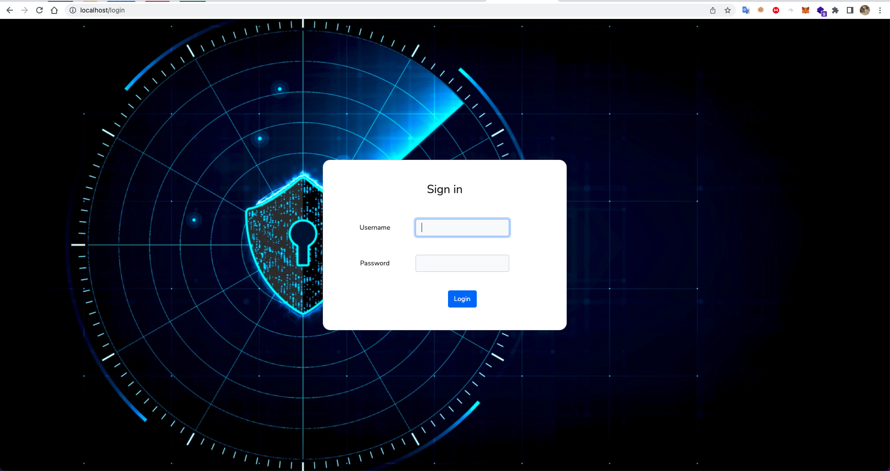
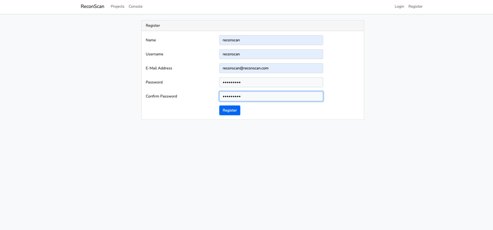
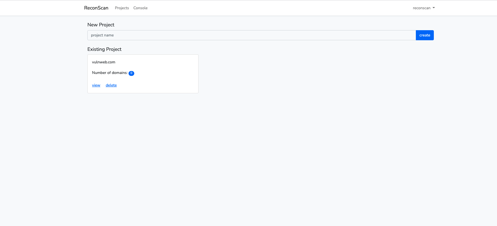
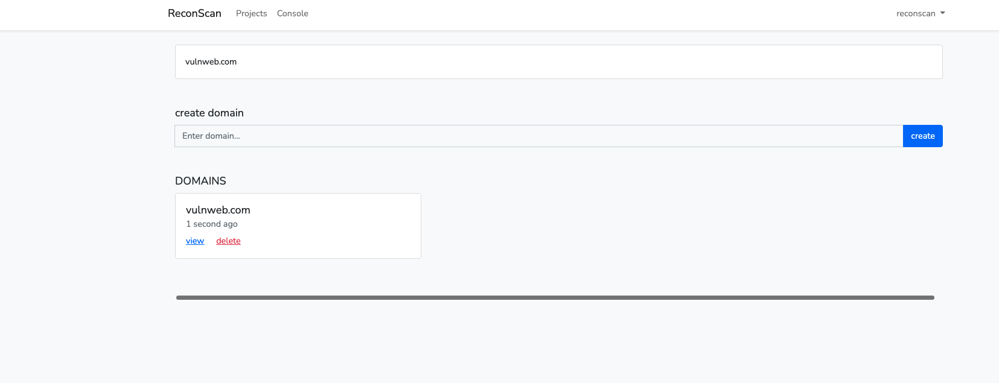
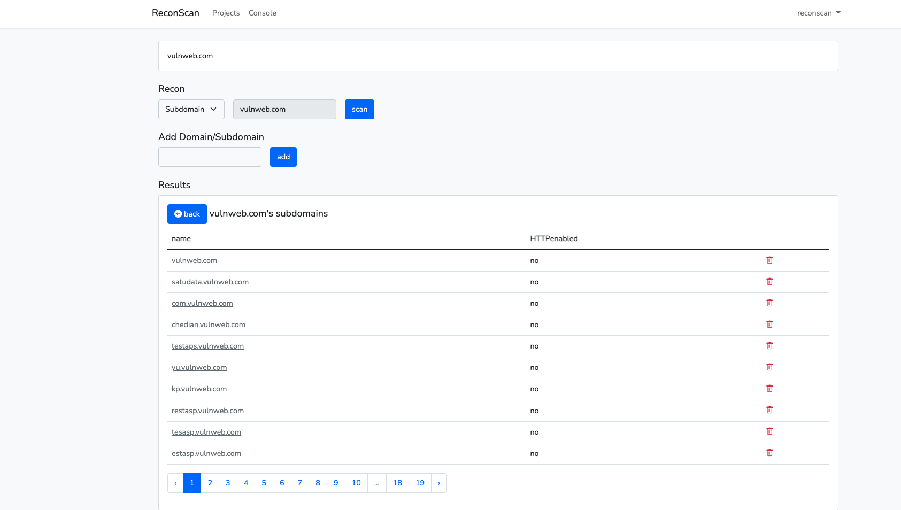
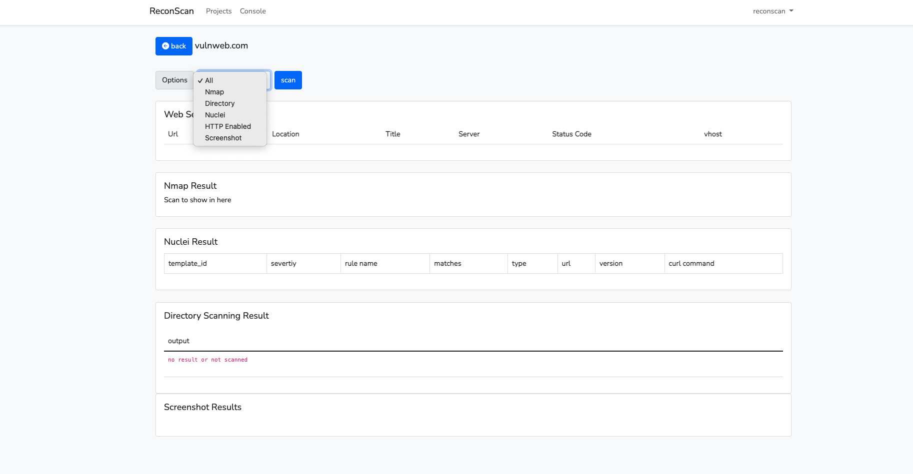

# Reconscan v1

Reconscan is a tool for:
* Subdomain domain discovery
* NMAP scan
* Nuclei scan
* HTTP enabled scan 
* Screenshot scan
* Directory scan
* Web terminal console

# Installation
I strongly recommend to run this tool using the docker image. If you want to run in local environment, you need to install subfinder, httpx, nuclei, nmap, EyeWitness in your local system.

## Docker

### step 1

`git clone https://github.com/weev3/reconscan;cd reconscan`

then

`docker build -t reconscan .`

or 

`docker pull kminthein/reconscan`

### step 2

`docker run --name=reconscan -t -p 80:80 -d reconscan`

If you cannot browse the reconscan then you can run 

`docker run --name=reconscan -t --network=host -d reconscan`

### step 3

`docker exec -ti reconscan bash`

### step 4
This step is required due to some restrictions. I tried to run laravel job inside docker entrypoint but failed to find some files after running. 

Run below command inside docker container. If you want to create mutiple thread, run below command multiple times in different sessions. You can use tmux ..etc.

` php /home/reconscan/artisan queue:work --timeout=0 `

## Without Docker
This tool is written with laravel so you need install laravel compatible packages like composer, php, mysql-server. Once you install them, you can run below command. 

### step 1

`git clone https://github.com/weev3/reconscan;cd reconscan`

### step 2
You need to change your project directory in .env file. In below example, your projects will be save in /tmp/projects/ directory.
```
...
CONSOLE_USER_NAME =reconscan
CONSOLE_USER_PASSWORD =reconscan
PROJECT_DIR = /tmp/projects/
```


### step 2

` composer update && composer install `

### step 3

` php artisan key:generate && php artisan cache:clear && php artisan migrate:fresh`

### step 4

`php artisan serve`

### step 5
In another terminal run 

`php /home/reconscan/artisan queue:work --timeout=0 `

Once above steps are done, you can start browsing to http://127.0.0.1:8000. 


# Usage

## Registration
You must register your first account by visting http://127.0.0.1:8000/register


# UI
Each project can have multiple domain and each domain can have multiple subdomains. 

## Project
You can create your project by clicking Projects nav bar.


## Domain 
You can create domain by clicking view link for each project.


## Subdomain
Once you created domain. You can scan all the subdomain avaiables by clicking scan button. Please note that all scan need to run  ` php /home/reconscan/artisan queue:work --timeout=0 `.

Reconscan will start finding subdomains and http enabled domains. 


## Options availabe 
Currently 5 scan options availabe and these are
1. Directory
2. Nmap
3. Nuclei
4. HTTP Enabled
5. Screenshot
6. Web Terminal


## Directory Lists
If you want to add your own directory list, you can add in **resources/wordlists** folder. 


# Road Map
Things to add in future....
* Issue tracking
* Shodan scanning
* Secret discovery
* Code review using codeql

# Video
[](https://vimeo.com/707539436)

# Issues
Feel free to use this tool and please submit PR if you found any issue. 


